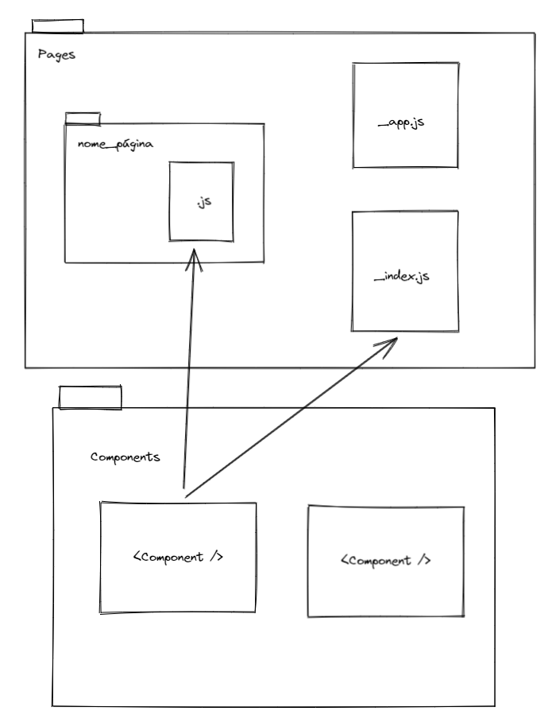

# Soil Correction Interface
Interface da aplicação de correção de solo desenvolvida utilizando o framework Next Js.

## Estrutura de pastas

O projeto está organizado respeitando o padrão de estrutura de pastas do framework **Next js**. Na pasta `/pages` estão os arquivos que definem uma página. O nome da pasta que guarda esse arquivo é que define uma rota. Por exemplo, dentro do diretório `/pages` temos a pasta `/Fosforo`, e dentro desta pasta temos um arquivo `index.js`, a rota para acessar a página no navegador será então `https://domínio_do_site/Fosforo`. Páginas fora do diretório `/pages` não são encontradas pela engine do Next Js.


O arquivo `_app.js` é responsável por guardar o código que será lido em tempo de renderização pelo Next Js. Nele é possível definir informações que serão usadas dentro de todas as outras páginas do site. O arquivo `index.js` é o ponto de partida do site e é representado pela rota raiz `https://dominio_do_site/`.    

Dentro da pasta `/components` são guardados os códigos relacionados à componentes da interface do usuário (UI) e que podem ser utilzados em diferentes trechos por diferentes arquivos de página. Os componentes são definidos a partir do uso da biblioteca de estilização e componentização `styled-components`.



## Assets e arquivos public

O Next JS entende que a pasta `public` guarda arquivos que poderão ser referenciados dentro de qualquer página, independente do aninhamento de rotas em que elas esteja. Assim é possível declara o uso de uma imagem apenas usando o nome da própria imagem:

```html
<!-- Sem public -->


<!-- com public -->


```
## Utilização do projeto e Build

Para utilizar o projeto é preciso que o computador tenha uma versão do NodeJs instalado. Após clonar o repositório, navegue até a pasta raiz do projeto e rode o seguinte comando para instalar as dependências:

```bash
npm install
# ou
yarn install
```
Após instalar as dependências, já será possível rodar o projeto em modo de desenvolvimento, basta usar os seguintes comandos:
```bash
npm run dev
# ou
yarn dev
```

Para realizar o `build` da aplicação, basta usar o comando:

```bash 
yarn build
# ou
npm run build
```

E para rodar a aplicação em produção:
```bash 
yarn start
# ou
npm start
```

A url padrão do projeto é [http://localhost:3000](http://localhost:3000), você pode acessá-la pelo navegador e começar a utilizar a aplicação.

## Testes

O projeto utiliza a biblitoca open source `Cypress` para realizar teste de interface, integração, dentre outros. A biblioteca pode ser consultada em [https://docs.cypress.io/guides/overview/why-cypress/](https://docs.cypress.io/guides/overview/why-cypress/).

Para rodar os testes em ambiente local é preciso rodar os seguintes comandos no terminal:
```bash
yarn run test
```

Esse comando faz a `build` do projeto e após isso o executa. Logo em seguida o mesmo comando roda o comando nativo do cypress `cypress open` que por sua vez abre o ambiente de desenvolvimento do Cypress para realizar os teste na url `http://localhost:8080`.

Ao abrir a URL será mostrado uma janela com os testes escritos, o usuário pode clicar em um deles para ver os resultados do teste.